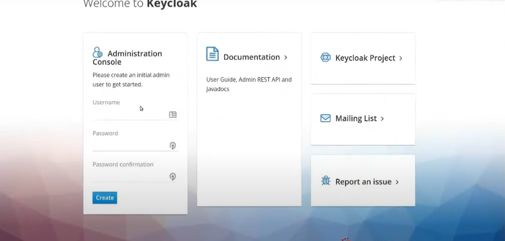

<h1 align="center">
  Docker Compose + keycloack + Postgrees  
</h1>

    

<h1 align="center">
  Sumario  
</h1>

   <a href="#---docker-compose-">Docker Compose</a> •
   <a href="#ide-eclipse">Ide Eclipse</a> •
   <a href="#configurar-sonar-no-eclipse">Sonar</a> •
   <a href="#configurar-jacoco">Jacoco</a> •
   <a href="#plugin-sonarlint">sonarlint</a> 

<h1 align="center">
   Docker Compose 
</h1>

## O que é Docker Compose?
O Docker Compose é uma ferramenta que permite definir e gerir aplicações Docker que usam vários contêineres. Ele facilita a execução de serviços interconectados, como bancos de dados, APIs e front-end. 

## Como funciona?
Define serviços em um arquivo YAML e os inicia com um único comando.

## O que faz?
Orquestra containers, cria redes, constrói imagens e vincula contêineres.

## Quem usa?
Profissionais de desenvolvimento, teste, staging, CI e DevOps.

<h1 align="center">
   keycloack 
</h1>

## O que é o keycloack?
Keycloak é uma solução de gerenciamento de acesso e identidade de código aberto que visa principalmente aplicativos e serviços. Os usuários podem autenticar com o Keycloak em vez de aplicativos individuais. Assim, as aplicações não precisam lidar com formulários de login, autenticando e armazenando usuários.

## Funcionalidades?
Single Sign-On (SSO), autenticação centralizada, autorização e controle de acesso.

## Gerenciamento?
Console de gerenciamento de contas, console admin para gerenciamento central de usuários

## Suporte de protocolos?
Compatível com protocolos de autenticação como OAuth 2.0, OpenID Connect e SAML.

# Requisito mínimo para antes de começar!.

## 1 - Step;
Ter o docker desktop instalado na maquina.
Para instalar é facil é só ir na pagina do docker fazer download de acordo com seu **S.O** e instalar.

## 2 - Step. 
Observação. 
Para executar o seu projeto, **o docker desktop deve esta sendo execuatdo** em sua maquina. Caso contrario vai da erro.

## 3 - Step.
Ao executar o seu projeto pela primiera vez **vai demorar um pouco pois o docker irá fazer o pull das imagens** para a sua maquina.

## 4 - Step.
ter o banco de dados postgrees instalado em seu computador.

<h1 align="center">
  Requisito mínimo atendido.
</h1>

# 1 - Vamos criar o arquivo 'docker-compose.yml' como no exemplo abaixo.
##  Arquivo docker-compose.yml

                  services:
                    postgres:
                      image: postgres
                      environment:
                        POSTGRES_DB: keycloak
                        POSTGRES_USER: keycloak
                        POSTGRES_PASSWORD: keycloak
                      volumes:
                        - C:/java-estudos-2025/banco_db_postgres_docker:/var/lib/postgresql/data
                        - ./init-schema.sql:/docker-entrypoint-initdb.d/init-schema.sql
                      ports:
                       - 3333:5432
                      networks:
                        - keycloak_network
                   
                    keycloak:
                      image: quay.io/keycloak/keycloak:legacy
                      environment:
                        DB_VENDOR: POSTGRES
                        DB_ADDR: postgres
                        DB_DATABASE: keycloak
                        DB_USER: keycloak
                        DB_SCHEMA: keycloak_schema
                        DB_PASSWORD: keycloak
                        KEYCLOAK_USER: admin
                        KEYCLOAK_PASSWORD: admin
                      ports:
                        - 8080:8080
                      depends_on:
                        - postgres
                      networks:
                        - keycloak_network
                        
                  networks:
                    keycloak_network:
                      driver: bridge

# 1.1 - O Arquivo compose 'docker-compose.yml'.
##  Arquivo  'docker-compose.yml'
Compose é uma ferramenta para gerenciar múltiplos contêineres. 
No exemplo acima 'docker-compose.yml' podemos observar dois serviços são eles. 
        - postgres 
        - keycloak 
Cada serviço com as suas configuraçoes, portas, redes ... 
          

# 2 - Vamos criar o arquivoe o 'init-schema.sql' como no exemplo abaixo.
##  Arquivo  'init-schema.sql'

              DO $$
                BEGIN
                    IF NOT EXISTS(
                        SELECT schema_name
                        FROM information_schema.schemata
                        WHERE schema_name = 'keycloak_schema'
                    ) THEN
                        EXECUTE 'CREATE SCHEMA keycloak_schema';
                    END IF;
                END
                $$;

# 2.1 - O Arquivo compose 'init-schema.sql'.
  **SQL** é um script de criação de schema_name e nome da schema_name. 
  O Arquivo compose **'docker-compose.yml'** faz a chamada deste sql apos a instalação do postgrees. 

<h1 align="center">
  Executando o arquivo 'docker-compose.yml' 
</h1>

  1 - Va ate o diretorio onde se encontra o arquivo  **'docker-compose.yml'** via promtp de comando.

  2 - No diretorio onde esta o arquivo  execute o comando **docker-compose up -d**.

  3 - Apos a execução do comando isso pode levar alguns minutos.

#  saida:

    

      
 4 -  Com isso o Keycloak estará no ar e o schema e tabelas deve esta criado em seu banco de dados.   
        1 - O Keycloak ira a tabelas necessaria para o seu controles e gerencimaneto. 
        2 - A imagem Keycloak deve esta em execução.
        3 - A imagem do postgrees também deve esta em execução.

 5 - Verificando se as imagens estão rodando execute o comando 'docker ps':

  #  saida:

    

        
<h1 align="center">
Criação da conta de administrador no keycloak
</h1>

  1 - O usuario administrador console foi criado em seu arquivo **'docker-compose.yml'**   
     - usuario: admin  
     - senha: admin  

  2 - Abra http://localhost:8080/auth
    
  3 - A página de boas-vindas é aberta, confirmando que o servidor está funcionando.Página de boas-vindas
  
  5 - E faça login no console de administração do Keycloak usando a conta de console administrador..
  
    
 

<h1 align="center">
Criar um realm
</h1>
   
  ## O que é o realm? 
   R: O **realm** e como se fosse uma work space um agrupamento de recursos. 
   recursos: 
        usuarios. 
        Roles. 
        Grupos. 
        Regras. 

         
  1 - Vá para o endereço  http://localhost:8080/auth/.

  2 - Por default a master ja vem criada.No menu Master, clique em **Add Realm**. Quando você está conectado ao domínio master, este menu lista todos os outros reinos.
   
  3 - Assim que você se logar na aplicação do lado esquerdo superior você verá o nome **Master**.
   
  4 - Ao passar o curso do mouse por cima do nome master será exibido um botão com a opção de **Add um realm**.
   
  5 - clique no botão **add realm**.    
   
  6 - No campo name iremos colocar o nome **"REALM_SISTEMA"**.
    
  7 - Após a definição do nome do seu realm clique no botão **create**.E pronto!
  

  <h1 align="center">
    Criar o usuario.
  </h1>
  
  1 - No realm **"REALM_SISTEMA"**, você cria um novo usuário.
  
  2 - No menu, clique em usuários para abrir a página da lista de usuários.
    
  3 - No lado direito da lista de usuários vazia, clique em **Adicionar usuário** para abrir a página Adicionar usuário.
    
  4 - Insira um nome no campo nome de usuário e um email no campo Email e clique em salvar. 
        **nome usuario: eduardo1** 
        **email: eduardo1@email**com 
        **senha: 123123** 
              
 
  5 - Clique na guia Credenciais para definir uma senha para o novo usuário.
  
  7 - Digite uma nova senha e confirme-a.
  
  8 - Clique em Definir senha para definir a senha do usuário como a nova que você especificou.

  <h1 align="center">
    Criar um grupo
  </h1>

 1 - Vá em **groups**.
 
 2 - Clique no botão **'create group'**.
 
 3 - Defina um nome para o grupo no caso **'Administrador'**.
 
 4 - URL root: nome do host do aplicativo

 5 - Vá novamente na opção **usuarios** e selecione o usuario **'eduardo1'** selecione a **'aba Groups'**.

 6 - Selecione o **Groups** que você acabou de criar no caso  **'Administrador'** será feita associação do usuario **'eduardo1'** ao grupo **'Administrador'** client em join.

 7  - Validar volte para a opção **'Groups'** selecione o grupo  **'Administrador'** vá na aba **Menbers** la estará o usuario **'eduardo1'** associado ao grupo **'Administrador'**.

  <h1 align="center">
    Criar as roles
  </h1>

 1 - Vá em **realm roles**.
 
 2 - Clique no botão **'create role'**.
 
 3 - Defina um nome para a role no caso **'Administrador_role'**.
 
 4 - Coloque na descrição o que essa role permite fazer. 
 Exemplo: **'acesso full na aplicação' e clique no botão save**.

 5 - Volte para a opção **'Groups'** selecione a aba **'Role mapping'** e faça a **associação com a role que você acabou** de criar no caso **'Administrador_role'**.

 6 - Selecione o groups que você acabou de criar no caso  **'Administrador'** será feita associação do usuario **'eduardo1'** ao grupo **'Administrador'** client em join.
      
  <h1 align="center">
    Adicionar um Client
  </h1>

 1 - Vá em **Clients**.
 
 2 - Clique no botão **Create client**. defina um nome **client_sistema**.
 
 3 - Vamos usar o protocolo: **OpenID-Connect**
 
 4 - Clique no **botão next**.

 5 - Ative a opçao **Client authentication** e **Authorization** e deixe marcado o check box **Standard flow** e **Direct access grants**.

 6 - Volte para a opçao **Clients** e clique na **settings**. 
   - 6.1 - Campo **Name** defina o valor ${client_account}. 
   - 6.2 - Campo **Root url** ${authBaseUrl} 
   - 6.3 - Campo **Home url**  
     - 6.3.1 - Observação:  
          Padrão -> **Home url /realms/SEU-REALM/account/**  
          Exemplo como fica -> **/realms/REALM_SISTEMA/account/** realm que criamos logo no inicio **REALM_SISTEMA**. 
  - 6.4 - Campo **Valid redirect URIs**  
    - 6.4.1 - Observação:  
          Padrão -> **Valid redirect URIs /realms/SEU-REALM/account/*.**  
          Exemplo como fica -> **/realms/REALM_SISTEMA/account/*.** realm que criamos logo no inicio **REALM_SISTEMA**.            
                

  <h1 align="center">
    Adicionar um Client scopes
  </h1>

 1 - Vá em **Client scopes**.
 
 2 - Clique na opção  **Roles**.
 
 3 - Clique na aba **scopes**.
 
 4 - Clique no **botão next**.

 5 - Nesta aba estará todas as roles que você criou no nosso caso **'Administrador_role'** seleciona a sua role e clique no botão **Assign**.

 6 - Volte para a opção **Client scopes** e Clique na aba **Mappers** selecione **Client roles**  na opçao **Client ID** selecione o client que você criou no nosso caso a **client_sistema**.

  <h1 align="center">
    Vamos testar o usuario 'eduardo1'
  </h1>

  1 - Vá em **Client**.
 
 2 - Selecione o client que foi criado por nos  **client_sistema** .
 
 3 - Na linha do nosso cliente existe uma URL **http://localhost:8080/auth/realms/REALM_SISTEMA/account/**.
 
 4 - Clique na url **http://localhost:8080/auth/realms/REALM_SISTEMA/account/** logo você será redirecionado para uma tela de login de teste.

 Será exibida a seguinte tela.

 

    

5 - clique em **Personal info** e digite: 
        **usuario: eduardo1** 
        **senha: 123123** 
Se tudo der certo você sera direcionado para a tela principal do usuario. 
   

# Fim

